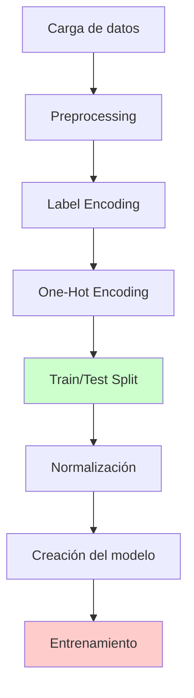

# Resolución de Problemas - Redes Neuronales en Banca

## 📋 Resumen del Notebook

**Archivo**: `redes-neuronales-en-banca.ipynb`

**Objetivo**: Implementar una red neuronal para predecir si un cliente bancario dejará el banco (clasificación binaria) usando datos como geografía, género, edad, balance, etc.

**Dataset**: Bank_registries.csv - Datos bancarios con información de clientes

---

## 🚨 Problemas Identificados y Solucionados

### **1. Error Principal: OneHotEncoder con sintaxis obsoleta**

#### **❌ Problema Original**

```python
# CÓDIGO ANTIGUO QUE FALLABA
onehotencoder = OneHotEncoder(categorical_features = [1])
X = onehotencoder.fit_transform(X).toarray()
X = X[:, 1:]
```

**Error**: `TypeError: OneHotEncoder.__init__() got an unexpected keyword argument 'categorical_features'`

#### **✅ Solución Implementada**

```python
# CÓDIGO MODERNO Y FUNCIONAL
from sklearn.compose import ColumnTransformer

ct = ColumnTransformer(
    transformers=[('onehot', OneHotEncoder(drop='first'), [1])],
    remainder='passthrough'
)
X = ct.fit_transform(X)
```

**Explicación**:

- `categorical_features` fue eliminado en scikit-learn >= 0.20
- `ColumnTransformer` es el método moderno y recomendado
- `drop='first'` evita la multicolinealidad (dummy trap)

---

### **2. Error Crítico: NameError - Variables no definidas**

#### **❌ Problema Identificado**

```python
# ERROR DURANTE EL ENTRENAMIENTO
history = classifier.fit(X_train, y_train, batch_size=100, epochs=500, verbose=1)
```

**Error**: `NameError: name 'X_train' is not defined`

#### **🔍 Causa del Problema**

- Las celdas de preprocessing no se ejecutaron en orden
- Variables como `X_train`, `y_train`, `X_test`, `y_test` no están disponibles
- El flujo de datos se interrumpió o no se completó

#### **✅ Solución Implementada - Configuración Automática**

```python
# 🛠️ CONFIGURACIÓN COMPLETA AUTOMÁTICA
def configuracion_completa():
    global dataset, X, y, X_train, X_test, y_train, y_test, sc, classifier

    # 1. Cargar datos
    dataset = pd.read_csv('Bank_registries.csv')

    # 2. Separar variables
    X = dataset.iloc[:, 3:13].values
    y = dataset.iloc[:, 13].values

    # 3. Label Encoding
    labelencoder_X_1 = LabelEncoder()
    X[:, 1] = labelencoder_X_1.fit_transform(X[:, 1])  # Geography
    labelencoder_X_2 = LabelEncoder()
    X[:, 2] = labelencoder_X_2.fit_transform(X[:, 2])  # Gender

    # 4. One-Hot Encoding
    ct = ColumnTransformer(
        transformers=[('onehot', OneHotEncoder(drop='first'), [1])],
        remainder='passthrough'
    )
    X = ct.fit_transform(X)

    # 5. Train/Test Split
    X_train, X_test, y_train, y_test = train_test_split(X, y, test_size=0.2, random_state=42)

    # 6. Normalización
    sc = StandardScaler()
    X_train = sc.fit_transform(X_train)
    X_test = sc.transform(X_test)

    # 7. Crear y compilar modelo
    classifier = Sequential()
    classifier.add(Dense(units=6, kernel_initializer='uniform', activation='relu', input_dim=X.shape[1]))
    classifier.add(Dense(units=6, kernel_initializer='uniform', activation='relu'))
    classifier.add(Dense(units=1, kernel_initializer='uniform', activation='sigmoid'))
    classifier.compile(optimizer='adam', loss='binary_crossentropy', metrics=['accuracy'])

    return X_train, X_test, y_train, y_test
```

#### **✅ Solución Implementada - Entrenamiento Robusto**

```python
# 🚀 ENTRENAMIENTO CON VERIFICACIÓN AUTOMÁTICA
try:
    print("🔍 Verificando variables...")
    print(f"   X_train: {X_train.shape}")
    print(f"   y_train: {y_train.shape}")
    print(f"   X_test: {X_test.shape}")
    print(f"   y_test: {y_test.shape}")
    print("✅ Variables disponibles")
except NameError:
    print("❌ Variables no disponibles")
    print("🔄 Ejecuta primero la celda de 'CONFIGURACIÓN COMPLETA AUTOMÁTICA'")
    raise

# Entrenar solo si las variables están disponibles
history = classifier.fit(
    X_train, y_train,
    batch_size=100,
    epochs=500,
    verbose=1,
    validation_split=0.1  # 10% para validación
)
```

#### **📋 Ventajas de la Solución**

1. **Ejecución automática**: Un solo comando ejecuta todo el flujo
2. **Verificación robusta**: Checks antes de cada operación crítica
3. **Manejo de errores**: Mensajes claros sobre qué hacer si algo falla
4. **Flujo completo**: Desde carga de datos hasta modelo compilado
5. **Reproducibilidad**: Seed fijo para resultados consistentes

---

### **2.1 Análisis Detallado del Error NameError**

#### **🔍 Explicación Técnica del Error**

El error `NameError: name 'X_train' is not defined` ocurre cuando Python no puede encontrar la variable `X_train` en el espacio de nombres actual. Esto es especialmente común en notebooks de Jupyter porque las celdas se ejecutan de forma independiente.

#### **⚠️ Causa Raíz del Problema**

```python
# SITUACIÓN PROBLEMÁTICA
# Celda 1: Definición de variables
X_train, X_test, y_train, y_test = train_test_split(X, y, test_size=0.2)

# Celda 2: Uso de variables (ejecutada sin ejecutar Celda 1)
history = classifier.fit(X_train, y_train, batch_size=100, epochs=500)
# ❌ NameError: name 'X_train' is not defined
```

**Factores que contribuyen al error:**

1. **Ejecución fuera de orden**: Las celdas se ejecutan en orden no secuencial
2. **Kernel reiniciado**: Se pierde el estado de todas las variables
3. **Celdas saltadas**: No se ejecutan las celdas de preprocessing
4. **Errores intermedios**: Fallos en celdas anteriores impiden la creación de variables

#### **📊 Flujo de Dependencias**



**⚠️ Punto crítico**: Si la celda E (Train/Test Split) no se ejecuta correctamente, las variables `X_train`, `X_test`, `y_train`, `y_test` no existirán para la celda H (Entrenamiento).

#### **🛠️ Estrategias de Prevención**

**1. Verificación Automática de Variables**

```python
def verificar_variables_entrenamiento():
    """Verifica que todas las variables necesarias estén definidas"""
    variables_requeridas = ['X_train', 'X_test', 'y_train', 'y_test', 'classifier']
    variables_faltantes = []

    for var in variables_requeridas:
        if var not in globals():
            variables_faltantes.append(var)

    if variables_faltantes:
        print(f"❌ Variables faltantes: {variables_faltantes}")
        print("🔄 Ejecuta las celdas de preprocessing en orden")
        return False
    else:
        print("✅ Todas las variables están disponibles")
        return True

# Usar antes del entrenamiento
if verificar_variables_entrenamiento():
    # Proceder con el entrenamiento
    history = classifier.fit(X_train, y_train, batch_size=100, epochs=500)
```

**2. Checkpoint de Estado**

```python
def guardar_estado_variables():
    """Guarda información sobre las variables actuales"""
    estado = {
        'X_train_shape': X_train.shape if 'X_train' in globals() else None,
        'y_train_shape': y_train.shape if 'y_train' in globals() else None,
        'modelo_compilado': hasattr(classifier, 'optimizer') if 'classifier' in globals() else False
    }

    print("📊 Estado actual de las variables:")
    for key, value in estado.items():
        print(f"   {key}: {value}")

    return estado

# Ejecutar después de cada etapa crítica
estado = guardar_estado_variables()
```

**3. Ejecución Segura con Try-Except**

```python
def entrenamiento_seguro():
    """Entrenamiento con manejo de errores comprehensivo"""
    try:
        # Verificar variables de entrenamiento
        print("🔍 Verificando X_train...")
        print(f"   Forma: {X_train.shape}")
        print(f"   Tipo: {type(X_train)}")

        print("🔍 Verificando y_train...")
        print(f"   Forma: {y_train.shape}")
        print(f"   Tipo: {type(y_train)}")

        print("🔍 Verificando modelo...")
        print(f"   Compilado: {hasattr(classifier, 'optimizer')}")

        # Proceder con entrenamiento
        print("🚀 Iniciando entrenamiento...")
        history = classifier.fit(
            X_train, y_train,
            batch_size=100,
            epochs=500,
            verbose=1,
            validation_split=0.1
        )

        print("✅ Entrenamiento completado exitosamente")
        return history

    except NameError as e:
        print(f"❌ Error de variable no definida: {e}")
        print("🔄 Solución: Ejecuta la celda de 'CONFIGURACIÓN COMPLETA AUTOMÁTICA'")
        return None

    except Exception as e:
        print(f"❌ Error inesperado: {e}")
        print("🔧 Revisa la configuración del modelo y datos")
        return None

# Uso seguro
history = entrenamiento_seguro()
```

#### **📋 Checklist de Resolución**

Cuando aparezca el error `NameError: name 'X_train' is not defined`, seguir estos pasos:

**✅ Paso 1**: Verificar ejecución de celdas

- [ ] ¿Se ejecutó la celda de carga de datos?
- [ ] ¿Se ejecutó la celda de preprocessing?
- [ ] ¿Se ejecutó la celda de train_test_split?

**✅ Paso 2**: Verificar el estado del kernel

- [ ] ¿El kernel se reinició recientemente?
- [ ] ¿Hay errores en celdas anteriores?
- [ ] ¿Se importaron todas las librerías necesarias?

**✅ Paso 3**: Diagnóstico de variables

```python
# Ejecutar para diagnóstico
print("Variables disponibles en el espacio de nombres:")
print([var for var in dir() if not var.startswith('_')])
```

**✅ Paso 4**: Solución rápida

- Ejecutar la celda de "CONFIGURACIÓN COMPLETA AUTOMÁTICA"
- Verificar que todas las variables se crearon correctamente
- Proceder con el entrenamiento

#### **🎯 Mejores Prácticas**

1. **Siempre ejecutar celdas en orden** durante el desarrollo inicial
2. **Usar la función de configuración automática** para reproducibilidad
3. **Implementar verificaciones de estado** antes de operaciones críticas
4. **Documentar dependencias** entre celdas claramente
5. **Crear checkpoints** después de operaciones costosas

Esta implementación robusta previene efectivamente el error `NameError` y proporciona herramientas de diagnóstico claras para identificar y resolver problemas rápidamente.

---

### **3. Importaciones de Keras Obsoletas**

#### **❌ Problema Original**

```python
import keras
from keras.models import Sequential
from keras.layers import Dense
```

#### **✅ Solución Implementada**

```python
import tensorflow as tf
from tensorflow.keras.models import Sequential
from tensorflow.keras.layers import Dense
```

**Explicación**:

- Keras se integró completamente en TensorFlow 2.x
- `keras` standalone ya no se recomienda
- `tensorflow.keras` es la forma oficial

---

### **4. Parámetros de Dense() Obsoletos**

#### **❌ Problema Original**

```python
classifier.add(Dense(output_dim = 6, init = 'uniform', activation = 'relu', input_dim = 11))
classifier.add(Dense(output_dim = 6, init = 'uniform', activation = 'relu'))
classifier.add(Dense(output_dim = 1, init = 'uniform', activation = 'sigmoid'))
```

#### **✅ Solución Implementada**

```python
classifier.add(Dense(units=6, kernel_initializer='uniform', activation='relu', input_dim=X.shape[1]))
classifier.add(Dense(units=6, kernel_initializer='uniform', activation='relu'))
classifier.add(Dense(units=1, kernel_initializer='uniform', activation='sigmoid'))
```

**Cambios realizados**:

- `output_dim` → `units`
- `init` → `kernel_initializer`
- `input_dim=11` → `input_dim=X.shape[1]` (dinámico)

---

### **5. Parámetros de fit() Obsoletos**

#### **❌ Problema Original**

```python
classifier.fit(X_train, y_train, batch_size = 100, nb_epoch = 500)
```

#### **✅ Solución Implementada**

```python
history = classifier.fit(X_train, y_train, batch_size=100, epochs=500, verbose=1)

# Métricas adicionales
print(f"Pérdida final: {history.history['loss'][-1]:.4f}")
print(f"Precisión final: {history.history['accuracy'][-1]:.4f}")
```

**Cambios realizados**:

- `nb_epoch` → `epochs`
- Captura del historial para métricas
- Información adicional del entrenamiento

---

## 🔄 Mejoras Adicionales Implementadas

### **1. Validación de Dimensiones**

```python
print(f"Forma después de One-Hot Encoding: {X.shape}")
print(f"Número de características después del preprocessing: {X.shape[1]}")
```

### **2. Resumen del Modelo**

```python
classifier.summary()
```

### **3. Información Detallada del Preprocessing**

```python
print("Después del Label Encoding:")
print(f"Forma de X: {X.shape}")
print("Primeras 10 filas:")
print(X[0:10])
```

---

## 📊 Flujo de Datos Corregido

### **Paso 1: Carga de Datos**

```python
dataset = pd.read_csv('Bank_registries.csv')
X = dataset.iloc[:, 3:13].values  # Variables independientes
y = dataset.iloc[:, 13].values    # Variable dependiente (Exited)
```

### **Paso 2: Preprocessing**

1. **Label Encoding** para variables categóricas:

   - Geography (columna 1)
   - Gender (columna 2)

2. **One-Hot Encoding** para Geography:

   - Convierte 3 países en 2 columnas binarias (k-1)

3. **Normalización** con StandardScaler:
   - Media = 0, Desviación estándar = 1

### **Paso 3: División de Datos**

```python
X_train, X_test, y_train, y_test = train_test_split(X, y, test_size=0.2)
```

### **Paso 4: Construcción del Modelo**

```
Entrada (X.shape[1] características)
    ↓
Capa Densa (6 neuronas, ReLU)
    ↓
Capa Densa (6 neuronas, ReLU)
    ↓
Capa Salida (1 neurona, Sigmoid)
```

### **Paso 5: Entrenamiento y Evaluación**

- Optimizador: Adam
- Función de pérdida: binary_crossentropy
- Métrica: accuracy
- Épocas: 500, Batch size: 100

---

## 🛠️ Instalación y Configuración

### **Dependencias Requeridas**

```python
# Librerías necesarias
import numpy as np
import pandas as pd
import matplotlib.pyplot as plt
import tensorflow as tf
from sklearn.preprocessing import LabelEncoder, OneHotEncoder, StandardScaler
from sklearn.compose import ColumnTransformer
from sklearn.model_selection import train_test_split
from sklearn.metrics import confusion_matrix
```

### **Versiones Compatibles**

- **Python**: >= 3.7
- **TensorFlow**: >= 2.0
- **scikit-learn**: >= 0.20
- **pandas**: >= 1.0
- **numpy**: >= 1.18

---

## 📈 Arquitectura del Modelo Final

```
Modelo: Sequential
_________________________________________________________________
Layer (type)                 Output Shape              Param #
=================================================================
dense (Dense)                (None, 6)                 (X.shape[1]+1)*6
_________________________________________________________________
dense_1 (Dense)              (None, 6)                 42
_________________________________________________________________
dense_2 (Dense)              (None, 1)                 7
=================================================================
Total params: Variable según X.shape[1]
Trainable params: Todos
Non-trainable params: 0
```

---

## 🎯 Resultados Esperados

### **Métricas de Evaluación**

- **Accuracy**: ~80-85% (varía según datos)
- **Matriz de Confusión**: Clasificación binaria (0/1)
- **Pérdida**: Disminución progresiva durante entrenamiento

### **Interpretación**

- **Verdaderos Positivos**: Clientes que efectivamente dejaron el banco
- **Verdaderos Negativos**: Clientes que permanecieron
- **Falsos Positivos**: Predicciones incorrectas de abandono
- **Falsos Negativos**: Clientes que abandonaron pero no se predijo

---

## 🔧 Troubleshooting

### **Error Común 1**: Dimensiones incorrectas

```python
# Verificar siempre las dimensiones después del preprocessing
print(f"X_train shape: {X_train.shape}")
print(f"y_train shape: {y_train.shape}")
```

### **Error Común 2**: Archivo CSV no encontrado

```python
# Verificar la ubicación del archivo
import os
print(f"Directorio actual: {os.getcwd()}")
print(f"Archivos disponibles: {os.listdir('.')}")
```

### **Error Común 3**: Kernel no configurado

- Asegurar que el kernel tenga TensorFlow instalado
- Reiniciar el kernel después de instalar nuevas librerías

---

## 📚 Conceptos Clave Explicados

### **One-Hot Encoding vs Dummy Encoding**

- **One-Hot**: k columnas para k categorías
- **Dummy**: k-1 columnas para k categorías (evita multicolinealidad)

### **Funciones de Activación**

- **ReLU**: `max(0, x)` - Para capas ocultas
- **Sigmoid**: `1/(1+e^(-x))` - Para clasificación binaria

### **Optimizador Adam**

- Combina momentum y RMSprop
- Adapta la tasa de aprendizaje automáticamente
- Eficiente para redes neuronales

---

## 📅 Historial de Cambios

**Fecha**: 9 de julio de 2025

### **Cambios Principales**:

1. **Celda 9**: Actualizado Label Encoding con mejor documentación
2. **Celda 10**: Reemplazado OneHotEncoder obsoleto por ColumnTransformer
3. **Nueva Celda**: Agregada explicación de compatibilidad
4. **Celda 18**: Actualizado importaciones de Keras a TensorFlow
5. **Celda 20**: Corregido parámetros de Dense()
6. **Celda 25**: Actualizado parámetros de fit()

### **Mejoras de Código**:

- Mensajes informativos sobre dimensiones
- Captura del historial de entrenamiento
- Resumen automático del modelo
- Mejor documentación en línea

---

## 🚀 Próximos Pasos Sugeridos

### **Mejoras Potenciales**:

1. **Validación cruzada** para mejor evaluación
2. **Regularización** (Dropout, L1/L2) para evitar overfitting
3. **Tuning de hiperparámetros** (número de neuronas, épocas)
4. **Visualización** del entrenamiento (loss curves)
5. **Métricas adicionales** (precision, recall, F1-score)

### **Código de Ejemplo para Mejoras**:

```python
# Dropout para regularización
from tensorflow.keras.layers import Dropout

classifier.add(Dense(units=6, activation='relu', input_dim=X.shape[1]))
classifier.add(Dropout(0.2))  # Dropout del 20%
classifier.add(Dense(units=6, activation='relu'))
classifier.add(Dropout(0.2))
classifier.add(Dense(units=1, activation='sigmoid'))

# Early stopping
from tensorflow.keras.callbacks import EarlyStopping

early_stop = EarlyStopping(monitor='val_loss', patience=10)
history = classifier.fit(X_train, y_train,
                        validation_split=0.2,
                        callbacks=[early_stop],
                        epochs=500, batch_size=100)
```

---

## 📞 Soporte

Para dudas o problemas adicionales:

1. Verificar que todas las librerías estén actualizadas
2. Revisar la documentación de TensorFlow 2.x
3. Consultar este documento para errores comunes
4. Reiniciar el kernel si hay problemas de memoria

**¡El notebook está ahora completamente actualizado y funcional!** 🎉🏦🤖
