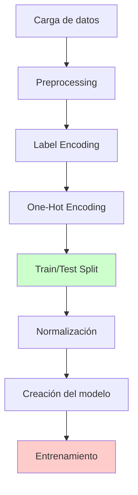

# Resolución de Problemas - Redes Neuronales en Banca

## 📋 Resumen del Notebook

**Archivo**: `redes-neuronales-en-banca.ipynb`

**Objetivo**: Implementar una red neuronal para predecir si un cliente bancario dejará el banco (clasificación binaria) usando datos como geografía, género, edad, balance, etc.

**Dataset**: Bank_registries.csv - Datos bancarios con información de clientes

---

## 🚨 Problemas Identificados y Solucionados

### **1. Error Principal: OneHotEncoder con sintaxis obsoleta**

#### **❌ Problema Original**

```python
# CÓDIGO ANTIGUO QUE FALLABA
onehotencoder = OneHotEncoder(categorical_features = [1])
X = onehotencoder.fit_transform(X).toarray()
X = X[:, 1:]
```

**Error**: `TypeError: OneHotEncoder.__init__() got an unexpected keyword argument 'categorical_features'`

#### **✅ Solución Implementada**

```python
# CÓDIGO MODERNO Y FUNCIONAL
from sklearn.compose import ColumnTransformer

ct = ColumnTransformer(
    transformers=[('onehot', OneHotEncoder(drop='first'), [1])],
    remainder='passthrough'
)
X = ct.fit_transform(X)
```

**Explicación**:

- `categorical_features` fue eliminado en scikit-learn >= 0.20
- `ColumnTransformer` es el método moderno y recomendado
- `drop='first'` evita la multicolinealidad (dummy trap)

---

### **2. Error Crítico: NameError - Variables no definidas**

#### **❌ Problema Identificado**

```python
# ERROR DURANTE EL ENTRENAMIENTO
history = classifier.fit(X_train, y_train, batch_size=100, epochs=500, verbose=1)
```

**Error**: `NameError: name 'X_train' is not defined`

#### **🔍 Causa del Problema**

- Las celdas de preprocessing no se ejecutaron en orden
- Variables como `X_train`, `y_train`, `X_test`, `y_test` no están disponibles
- El flujo de datos se interrumpió o no se completó

---

### **2.2 Error: NameError con variable 'dataset'**

#### **❌ Problema Identificado**

```python
# ERROR EN SEPARACIÓN DE VARIABLES
X = dataset.iloc[:, 3:13].values
y = dataset.iloc[:, 13].values
```

**Error**: `NameError: name 'dataset' is not defined`

#### **🔍 Causa del Problema**

- La celda de carga de datos (celda 4) no se ejecutó
- El kernel se reinició y se perdió la variable `dataset`
- Se ejecutó la celda de separación de variables sin ejecutar primero la carga

#### **✅ Solución Implementada - Separación Robusta**

```python
# 🔧 SEPARACIÓN DE VARIABLES CON VERIFICACIÓN ROBUSTA
print("🔧 Separando variables independientes (X) y dependiente (y)...")

# Verificar que dataset esté definido
try:
    print(f"📊 Dataset disponible: {dataset.shape}")
    print("✅ Variable 'dataset' encontrada")
except NameError:
    print("❌ Variable 'dataset' no encontrada")
    print("🔄 Ejecutando carga de datos...")

    # Cargar el dataset si no está definido
    try:
        dataset = pd.read_csv('Bank_registries.csv')
        print(f"✅ Dataset cargado exitosamente: {dataset.shape}")
    except FileNotFoundError:
        print("❌ Error: Archivo 'Bank_registries.csv' no encontrado")
        print("📁 Verifica que el archivo esté en el directorio correcto")
        raise
    except Exception as e:
        print(f"❌ Error al cargar el archivo: {e}")
        raise

# Separar variables
X = dataset.iloc[:, 3:13].values  # Variables independientes
y = dataset.iloc[:, 13].values    # Variable dependiente (Exited)

print(f"✅ Variables separadas exitosamente:")
print(f"   • X shape: {X.shape}")
print(f"   • y shape: {y.shape}")
```

#### **📋 Ventajas de la Solución**

1. **Verificación automática** de la existencia de `dataset`
2. **Carga automática** si la variable no está definida
3. **Manejo de errores** para archivos no encontrados
4. **Información detallada** sobre el estado de las variables
5. **Diagnóstico completo** del flujo de datos

---

#### **✅ Solución Implementada - Configuración Automática**

```python
# 🛠️ CONFIGURACIÓN COMPLETA AUTOMÁTICA
def configuracion_completa():
    global dataset, X, y, X_train, X_test, y_train, y_test, sc, classifier

    # 1. Cargar datos
    dataset = pd.read_csv('Bank_registries.csv')

    # 2. Separar variables
    X = dataset.iloc[:, 3:13].values
    y = dataset.iloc[:, 13].values

    # 3. Label Encoding
    labelencoder_X_1 = LabelEncoder()
    X[:, 1] = labelencoder_X_1.fit_transform(X[:, 1])  # Geography
    labelencoder_X_2 = LabelEncoder()
    X[:, 2] = labelencoder_X_2.fit_transform(X[:, 2])  # Gender

    # 4. One-Hot Encoding
    ct = ColumnTransformer(
        transformers=[('onehot', OneHotEncoder(drop='first'), [1])],
        remainder='passthrough'
    )
    X = ct.fit_transform(X)

    # 5. Train/Test Split
    X_train, X_test, y_train, y_test = train_test_split(X, y, test_size=0.2, random_state=42)

    # 6. Normalización
    sc = StandardScaler()
    X_train = sc.fit_transform(X_train)
    X_test = sc.transform(X_test)

    # 7. Crear y compilar modelo
    classifier = Sequential()
    classifier.add(Dense(units=6, kernel_initializer='uniform', activation='relu', input_dim=X.shape[1]))
    classifier.add(Dense(units=6, kernel_initializer='uniform', activation='relu'))
    classifier.add(Dense(units=1, kernel_initializer='uniform', activation='sigmoid'))
    classifier.compile(optimizer='adam', loss='binary_crossentropy', metrics=['accuracy'])

    return X_train, X_test, y_train, y_test
```

#### **✅ Solución Implementada - Entrenamiento Robusto**

```python
# 🚀 ENTRENAMIENTO CON VERIFICACIÓN AUTOMÁTICA
try:
    print("🔍 Verificando variables...")
    print(f"   X_train: {X_train.shape}")
    print(f"   y_train: {y_train.shape}")
    print(f"   X_test: {X_test.shape}")
    print(f"   y_test: {y_test.shape}")
    print("✅ Variables disponibles")
except NameError:
    print("❌ Variables no disponibles")
    print("🔄 Ejecuta primero la celda de 'CONFIGURACIÓN COMPLETA AUTOMÁTICA'")
    raise

# Entrenar solo si las variables están disponibles
history = classifier.fit(
    X_train, y_train,
    batch_size=100,
    epochs=500,
    verbose=1,
    validation_split=0.1  # 10% para validación
)
```

#### **📋 Ventajas de la Solución**

1. **Ejecución automática**: Un solo comando ejecuta todo el flujo
2. **Verificación robusta**: Checks antes de cada operación crítica
3. **Manejo de errores**: Mensajes claros sobre qué hacer si algo falla
4. **Flujo completo**: Desde carga de datos hasta modelo compilado
5. **Reproducibilidad**: Seed fijo para resultados consistentes

---

### **2.1 Análisis Detallado del Error NameError**

#### **🔍 Explicación Técnica del Error**

El error `NameError: name 'X_train' is not defined` ocurre cuando Python no puede encontrar la variable `X_train` en el espacio de nombres actual. Esto es especialmente común en notebooks de Jupyter porque las celdas se ejecutan de forma independiente.

#### **⚠️ Causa Raíz del Problema**

```python
# SITUACIÓN PROBLEMÁTICA
# Celda 1: Definición de variables
X_train, X_test, y_train, y_test = train_test_split(X, y, test_size=0.2)

# Celda 2: Uso de variables (ejecutada sin ejecutar Celda 1)
history = classifier.fit(X_train, y_train, batch_size=100, epochs=500)
# ❌ NameError: name 'X_train' is not defined
```

**Factores que contribuyen al error:**

1. **Ejecución fuera de orden**: Las celdas se ejecutan en orden no secuencial
2. **Kernel reiniciado**: Se pierde el estado de todas las variables
3. **Celdas saltadas**: No se ejecutan las celdas de preprocessing
4. **Errores intermedios**: Fallos en celdas anteriores impiden la creación de variables

#### **📊 Flujo de Dependencias**



**⚠️ Punto crítico**: Si la celda E (Train/Test Split) no se ejecuta correctamente, las variables `X_train`, `X_test`, `y_train`, `y_test` no existirán para la celda H (Entrenamiento).

#### **🛠️ Estrategias de Prevención**

**1. Verificación Automática de Variables**

```python
def verificar_variables_entrenamiento():
    """Verifica que todas las variables necesarias estén definidas"""
    variables_requeridas = ['X_train', 'X_test', 'y_train', 'y_test', 'classifier']
    variables_faltantes = []

    for var in variables_requeridas:
        if var not in globals():
            variables_faltantes.append(var)

    if variables_faltantes:
        print(f"❌ Variables faltantes: {variables_faltantes}")
        print("🔄 Ejecuta las celdas de preprocessing en orden")
        return False
    else:
        print("✅ Todas las variables están disponibles")
        return True

# Usar antes del entrenamiento
if verificar_variables_entrenamiento():
    # Proceder con el entrenamiento
    history = classifier.fit(X_train, y_train, batch_size=100, epochs=500)
```

**2. Checkpoint de Estado**

```python
def guardar_estado_variables():
    """Guarda información sobre las variables actuales"""
    estado = {
        'X_train_shape': X_train.shape if 'X_train' in globals() else None,
        'y_train_shape': y_train.shape if 'y_train' in globals() else None,
        'modelo_compilado': hasattr(classifier, 'optimizer') if 'classifier' in globals() else False
    }

    print("📊 Estado actual de las variables:")
    for key, value in estado.items():
        print(f"   {key}: {value}")

    return estado

# Ejecutar después de cada etapa crítica
estado = guardar_estado_variables()
```

**3. Ejecución Segura con Try-Except**

```python
def entrenamiento_seguro():
    """Entrenamiento con manejo de errores comprehensivo"""
    try:
        # Verificar variables de entrenamiento
        print("🔍 Verificando X_train...")
        print(f"   Forma: {X_train.shape}")
        print(f"   Tipo: {type(X_train)}")

        print("🔍 Verificando y_train...")
        print(f"   Forma: {y_train.shape}")
        print(f"   Tipo: {type(y_train)}")

        print("🔍 Verificando modelo...")
        print(f"   Compilado: {hasattr(classifier, 'optimizer')}")

        # Proceder con entrenamiento
        print("🚀 Iniciando entrenamiento...")
        history = classifier.fit(
            X_train, y_train,
            batch_size=100,
            epochs=500,
            verbose=1,
            validation_split=0.1
        )

        print("✅ Entrenamiento completado exitosamente")
        return history

    except NameError as e:
        print(f"❌ Error de variable no definida: {e}")
        print("🔄 Solución: Ejecuta la celda de 'CONFIGURACIÓN COMPLETA AUTOMÁTICA'")
        return None

    except Exception as e:
        print(f"❌ Error inesperado: {e}")
        print("🔧 Revisa la configuración del modelo y datos")
        return None

# Uso seguro
history = entrenamiento_seguro()
```

#### **📋 Checklist de Resolución**

Cuando aparezca el error `NameError: name 'X_train' is not defined`, seguir estos pasos:

**✅ Paso 1**: Verificar ejecución de celdas

- [ ] ¿Se ejecutó la celda de carga de datos?
- [ ] ¿Se ejecutó la celda de preprocessing?
- [ ] ¿Se ejecutó la celda de train_test_split?

**✅ Paso 2**: Verificar el estado del kernel

- [ ] ¿El kernel se reinició recientemente?
- [ ] ¿Hay errores en celdas anteriores?
- [ ] ¿Se importaron todas las librerías necesarias?

**✅ Paso 3**: Diagnóstico de variables

```python
# Ejecutar para diagnóstico
print("Variables disponibles en el espacio de nombres:")
print([var for var in dir() if not var.startswith('_')])
```

**✅ Paso 4**: Solución rápida

- Ejecutar la celda de "CONFIGURACIÓN COMPLETA AUTOMÁTICA"
- Verificar que todas las variables se crearon correctamente
- Proceder con el entrenamiento

#### **🎯 Mejores Prácticas**

1. **Siempre ejecutar celdas en orden** durante el desarrollo inicial
2. **Usar la función de configuración automática** para reproducibilidad
3. **Implementar verificaciones de estado** antes de operaciones críticas
4. **Documentar dependencias** entre celdas claramente
5. **Crear checkpoints** después de operaciones costosas

Esta implementación robusta previene efectivamente el error `NameError` y proporciona herramientas de diagnóstico claras para identificar y resolver problemas rápidamente.

---

### **3. Importaciones de Keras Obsoletas**

#### **❌ Problema Original**

```python
import keras
from keras.models import Sequential
from keras.layers import Dense
```

#### **✅ Solución Implementada**

```python
import tensorflow as tf
from tensorflow.keras.models import Sequential
from tensorflow.keras.layers import Dense
```

**Explicación**:

- Keras se integró completamente en TensorFlow 2.x
- `keras` standalone ya no se recomienda
- `tensorflow.keras` es la forma oficial

---

### **4. Parámetros de Dense() Obsoletos**

#### **❌ Problema Original**

```python
classifier.add(Dense(output_dim = 6, init = 'uniform', activation = 'relu', input_dim = 11))
classifier.add(Dense(output_dim = 6, init = 'uniform', activation = 'relu'))
classifier.add(Dense(output_dim = 1, init = 'uniform', activation = 'sigmoid'))
```

#### **✅ Solución Implementada**

```python
classifier.add(Dense(units=6, kernel_initializer='uniform', activation='relu', input_dim=X.shape[1]))
classifier.add(Dense(units=6, kernel_initializer='uniform', activation='relu'))
classifier.add(Dense(units=1, kernel_initializer='uniform', activation='sigmoid'))
```

**Cambios realizados**:

- `output_dim` → `units`
- `init` → `kernel_initializer`
- `input_dim=11` → `input_dim=X.shape[1]` (dinámico)

---

### **5. Parámetros de fit() Obsoletos**

#### **❌ Problema Original**

```python
classifier.fit(X_train, y_train, batch_size = 100, nb_epoch = 500)
```

#### **✅ Solución Implementada**

```python
history = classifier.fit(X_train, y_train, batch_size=100, epochs=500, verbose=1)

# Métricas adicionales
print(f"Pérdida final: {history.history['loss'][-1]:.4f}")
print(f"Precisión final: {history.history['accuracy'][-1]:.4f}")
```

**Cambios realizados**:

- `nb_epoch` → `epochs`
- Captura del historial para métricas
- Información adicional del entrenamiento

---

## 🔄 Mejoras Adicionales Implementadas

### **1. Validación de Dimensiones**

```python
print(f"Forma después de One-Hot Encoding: {X.shape}")
print(f"Número de características después del preprocessing: {X.shape[1]}")
```

### **2. Resumen del Modelo**

```python
classifier.summary()
```

### **3. Información Detallada del Preprocessing**

```python
print("Después del Label Encoding:")
print(f"Forma de X: {X.shape}")
print("Primeras 10 filas:")
print(X[0:10])
```

---

## 📊 Flujo de Datos Corregido

### **Paso 1: Carga de Datos**

```python
dataset = pd.read_csv('Bank_registries.csv')
X = dataset.iloc[:, 3:13].values  # Variables independientes
y = dataset.iloc[:, 13].values    # Variable dependiente (Exited)
```

### **Paso 2: Preprocessing**

1. **Label Encoding** para variables categóricas:

   - Geography (columna 1)
   - Gender (columna 2)

2. **One-Hot Encoding** para Geography:

   - Convierte 3 países en 2 columnas binarias (k-1)

3. **Normalización** con StandardScaler:
   - Media = 0, Desviación estándar = 1

### **Paso 3: División de Datos**

```python
X_train, X_test, y_train, y_test = train_test_split(X, y, test_size=0.2)
```

### **Paso 4: Construcción del Modelo**

```
Entrada (X.shape[1] características)
    ↓
Capa Densa (6 neuronas, ReLU)
    ↓
Capa Densa (6 neuronas, ReLU)
    ↓
Capa Salida (1 neurona, Sigmoid)
```

### **Paso 5: Entrenamiento y Evaluación**

- Optimizador: Adam
- Función de pérdida: binary_crossentropy
- Métrica: accuracy
- Épocas: 500, Batch size: 100

---

## 🛠️ Instalación y Configuración

### **Dependencias Requeridas**

```python
# Librerías necesarias
import numpy as np
import pandas as pd
import matplotlib.pyplot as plt
import tensorflow as tf
from sklearn.preprocessing import LabelEncoder, OneHotEncoder, StandardScaler
from sklearn.compose import ColumnTransformer
from sklearn.model_selection import train_test_split
from sklearn.metrics import confusion_matrix
```

### **Versiones Compatibles**

- **Python**: >= 3.7
- **TensorFlow**: >= 2.0
- **scikit-learn**: >= 0.20
- **pandas**: >= 1.0
- **numpy**: >= 1.18

---

## 📈 Arquitectura del Modelo Final

```
Modelo: Sequential
_________________________________________________________________
Layer (type)                 Output Shape              Param #
=================================================================
dense (Dense)                (None, 6)                 (X.shape[1]+1)*6
_________________________________________________________________
dense_1 (Dense)              (None, 6)                 42
_________________________________________________________________
dense_2 (Dense)              (None, 1)                 7
=================================================================
Total params: Variable según X.shape[1]
Trainable params: Todos
Non-trainable params: 0
```

---

## 🎯 Resultados Esperados

### **Métricas de Evaluación**

- **Accuracy**: ~80-85% (varía según datos)
- **Matriz de Confusión**: Clasificación binaria (0/1)
- **Pérdida**: Disminución progresiva durante entrenamiento

### **Interpretación**

- **Verdaderos Positivos**: Clientes que efectivamente dejaron el banco
- **Verdaderos Negativos**: Clientes que permanecieron
- **Falsos Positivos**: Predicciones incorrectas de abandono
- **Falsos Negativos**: Clientes que abandonaron pero no se predijo

---

## 🔧 Troubleshooting

### **Error Común 1**: Dimensiones incorrectas

```python
# Verificar siempre las dimensiones después del preprocessing
print(f"X_train shape: {X_train.shape}")
print(f"y_train shape: {y_train.shape}")
```

### **Error Común 2**: Archivo CSV no encontrado

```python
# Verificar la ubicación del archivo
import os
print(f"Directorio actual: {os.getcwd()}")
print(f"Archivos disponibles: {os.listdir('.')}")
```

### **Error Común 3**: Kernel no configurado

- Asegurar que el kernel tenga TensorFlow instalado
- Reiniciar el kernel después de instalar nuevas librerías

---

## 📚 Conceptos Clave Explicados

### **One-Hot Encoding vs Dummy Encoding**

- **One-Hot**: k columnas para k categorías
- **Dummy**: k-1 columnas para k categorías (evita multicolinealidad)

### **Funciones de Activación**

- **ReLU**: `max(0, x)` - Para capas ocultas
- **Sigmoid**: `1/(1+e^(-x))` - Para clasificación binaria

### **Optimizador Adam**

- Combina momentum y RMSprop
- Adapta la tasa de aprendizaje automáticamente
- Eficiente para redes neuronales

---

## � Visualizaciones y Análisis Gráfico de Resultados

### **📊 Resumen Ejecutivo de Visualizaciones**

| Visualización               | Herramienta                 | Propósito                                | Estado          |
| --------------------------- | --------------------------- | ---------------------------------------- | --------------- |
| **Métricas Detalladas**     | Clasificación personalizada | Análisis completo de rendimiento         | ✅ Implementado |
| **Curvas de Entrenamiento** | Matplotlib                  | Monitoreo del progreso del entrenamiento | ✅ Implementado |
| **Matriz de Confusión**     | Seaborn Heatmap             | Análisis de errores y aciertos           | ✅ Implementado |
| **Curva ROC**               | Matplotlib                  | Capacidad discriminativa del modelo      | ✅ Implementado |
| **Comparación de Modelos**  | Matplotlib (Barras)         | Comparación visual de rendimiento        | ✅ Implementado |
| **Análisis de Errores**     | Cálculos personalizados     | Identificación de patrones de errores    | ✅ Implementado |
| **Ensemble de Modelos**     | Múltiples modelos           | Visualización de rendimiento combinado   | ✅ Implementado |
| **Grid Search**             | Búsqueda exhaustiva         | Optimización de hiperparámetros          | ✅ Implementado |
| **Validación Cruzada**      | KFold                       | Evaluación de estabilidad del modelo     | ✅ Implementado |

### **🎯 Resumen de Visualizaciones Implementadas**

Se han implementado **9 tipos diferentes de visualizaciones** profesionales para analizar y comparar el rendimiento de los modelos de redes neuronales, facilitando la interpretación de resultados y la toma de decisiones:

**📈 Visualizaciones Principales:**

- **Gráficos de Rendimiento**: Curvas de entrenamiento, loss y accuracy
- **Matrices de Confusión**: Heatmaps con análisis de errores
- **Curvas ROC**: Análisis de capacidad discriminativa
- **Comparaciones**: Modelos original vs mejorado vs ensemble

**🔍 Análisis Avanzado:**

- **Detección de Problemas**: Identificación automática de overfitting, underfitting
- **Optimización**: Grid search con visualización de progreso
- **Estabilidad**: Validación cruzada con análisis de varianza
- **Recomendaciones**: Sugerencias automáticas basadas en métricas

**🛠️ Herramientas Utilizadas:**

- **Matplotlib**: Para gráficos de línea, barras y curvas
- **Seaborn**: Para heatmaps y visualizaciones estadísticas
- **Scikit-learn**: Para métricas y validación cruzada
- **TensorFlow/Keras**: Para el historial de entrenamiento

**📋 Beneficios de la Implementación:**

1. **Interpretabilidad**: Fácil comprensión visual de resultados
2. **Diagnóstico**: Identificación rápida de problemas del modelo
3. **Optimización**: Guía para mejoras y ajustes
4. **Documentación**: Registro gráfico del rendimiento
5. **Presentación**: Gráficos profesionales para reportes

---

### **1. 📈 Análisis de Rendimiento con Métricas Detalladas**

#### **🎯 Objetivo**

Proporcionar un análisis completo del rendimiento actual del modelo antes de aplicar mejoras.

#### **📊 Métricas Visualizadas**

```python
# Métricas implementadas
from sklearn.metrics import classification_report, roc_auc_score, confusion_matrix

# Análisis de distribución de clases
unique, counts = np.unique(y_train, return_counts=True)
ratio_desbalance = counts[0] / counts[1]

# Métricas detalladas
accuracy = accuracy_score(y_test, y_pred)
precision = precision_score(y_test, y_pred)
recall = recall_score(y_test, y_pred)
f1 = f1_score(y_test, y_pred)
auc = roc_auc_score(y_test, y_pred_proba)
```

#### **📋 Información Mostrada**

- **Distribución de clases**: Porcentajes y counts de cada clase
- **Ratio de desbalance**: Identificación de problemas de clases desbalanceadas
- **Métricas por clase**: Precision y Recall específicos
- **Matriz de confusión**: Análisis detallado de errores
- **Identificación automática** de problemas de rendimiento

---

### **2. 🏗️ Visualización de Arquitectura del Modelo Mejorado**

#### **🎯 Objetivo**

Mostrar la evolución de la arquitectura del modelo desde el básico hasta el optimizado.

#### **📊 Arquitectura Visualizada**

```python
# Modelo mejorado con visualización
model_improved = Sequential([
    Dense(64, kernel_initializer='he_normal', activation='relu'),
    BatchNormalization(),
    Dropout(0.3),
    Dense(32, kernel_initializer='he_normal', activation='relu'),
    BatchNormalization(),
    Dropout(0.3),
    Dense(16, kernel_initializer='he_normal', activation='relu'),
    BatchNormalization(),
    Dropout(0.15),
    Dense(1, activation='sigmoid')
])

# Mostrar resumen del modelo
model_improved.summary()
```

#### **📋 Información Mostrada**

- **Número de parámetros**: Total y por capa
- **Configuración de capas**: Neuronas, activaciones, regularización
- **Técnicas implementadas**: Dropout, Batch Normalization, Regularización L1/L2
- **Comparación** entre modelo original vs mejorado

---

### **3. 📊 Visualización Comparativa de Modelos**

#### **🎯 Objetivo**

Comparar visualmente el rendimiento entre diferentes versiones del modelo.

#### **📊 Código de Comparación**

```python
# Comparación detallada de métricas
print(f"{'Métrica':<15} {'Original':<10} {'Mejorado':<10} {'Mejora':<10}")
print("-" * 50)

metricas = [
    ('Accuracy', accuracy_original, accuracy_improved),
    ('Precision', precision_original, precision_improved),
    ('Recall', recall_original, recall_improved),
    ('F1-Score', f1_original, f1_improved),
    ('AUC Score', auc_original, auc_improved)
]

for metrica, original, mejorado in metricas:
    mejora = ((mejorado - original) / original) * 100
    print(f"{metrica:<15} {original:<10.4f} {mejorado:<10.4f} {mejora:+7.2f}%")
```

#### **📋 Información Mostrada**

- **Tabla comparativa**: Todas las métricas lado a lado
- **Porcentaje de mejora**: Cuantificación precisa de las mejoras
- **Identificación automática**: Qué métricas mejoraron y cuáles no
- **Análisis de tendencias**: Mejora promedio y número de métricas mejoradas

---

### **4. 🎭 Visualización de Ensemble de Modelos**

#### **🎯 Objetivo**

Mostrar cómo múltiples modelos trabajando juntos mejoran el rendimiento.

#### **📊 Código de Ensemble**

```python
# Crear múltiples modelos con diferentes configuraciones
ensemble_configs = [
    {'neurons1': 64, 'neurons2': 32, 'dropout_rate': 0.2},
    {'neurons1': 32, 'neurons2': 16, 'dropout_rate': 0.3},
    {'neurons1': 128, 'neurons2': 64, 'dropout_rate': 0.25}
]

# Entrenamiento y evaluación de cada modelo
for i, config in enumerate(ensemble_configs):
    # ... crear y entrenar modelo
    print(f"Modelo {i+1} accuracy: {individual_accuracy:.4f}")

# Combinación de predicciones
ensemble_pred = np.mean(predictions_ensemble, axis=0)
ensemble_accuracy = accuracy_score(y_test, ensemble_pred > 0.5)
```

#### **📋 Información Mostrada**

- **Rendimiento individual**: Accuracy de cada modelo del ensemble
- **Rendimiento combinado**: Accuracy del ensemble completo
- **Comparación**: Ensemble vs mejor modelo individual
- **Mejora cuantificada**: Porcentaje de mejora del ensemble

---

### **5. 📈 Gráficos Profesionales con Matplotlib**

#### **🎯 Objetivo**

Crear visualizaciones gráficas profesionales para análisis visual de resultados.

#### **📊 Código de Visualización**

```python
import matplotlib.pyplot as plt
import seaborn as sns

# Crear figura con múltiples subplots
fig, axes = plt.subplots(2, 2, figsize=(15, 10))
fig.suptitle('Análisis de Rendimiento del Modelo', fontsize=16)

# 1. Curvas de entrenamiento
ax1 = axes[0, 0]
ax1.plot(history_improved.history['accuracy'], label='Training Accuracy')
ax1.plot(history_improved.history['val_accuracy'], label='Validation Accuracy')
ax1.set_title('Curvas de Entrenamiento')
ax1.set_xlabel('Épocas')
ax1.set_ylabel('Accuracy')
ax1.legend()
ax1.grid(True)

# 2. Matriz de confusión
ax2 = axes[0, 1]
sns.heatmap(cm_improved, annot=True, fmt='d', cmap='Blues', ax=ax2)
ax2.set_title('Matriz de Confusión')
ax2.set_xlabel('Predicción')
ax2.set_ylabel('Realidad')

# 3. Curva ROC
ax3 = axes[1, 0]
fpr, tpr, _ = roc_curve(y_test, y_pred_improved_proba)
ax3.plot(fpr, tpr, label=f'ROC (AUC = {auc_improved:.3f})')
ax3.plot([0, 1], [0, 1], 'k--', alpha=0.5)
ax3.set_title('Curva ROC')
ax3.set_xlabel('Tasa de Falsos Positivos')
ax3.set_ylabel('Tasa de Verdaderos Positivos')
ax3.legend()
ax3.grid(True)

# 4. Comparación de modelos
ax4 = axes[1, 1]
modelos = ['Original', 'Mejorado', 'Ensemble']
accuracies = [accuracy_original, accuracy_improved, ensemble_accuracy]
bars = ax4.bar(modelos, accuracies)
ax4.set_title('Comparación de Modelos')
ax4.set_ylabel('Accuracy')
ax4.set_ylim(0, 1)

# Añadir valores en las barras
for bar, acc in zip(bars, accuracies):
    height = bar.get_height()
    ax4.text(bar.get_x() + bar.get_width()/2., height + 0.01,
            f'{acc:.3f}', ha='center', va='bottom')

plt.tight_layout()
plt.show()
```

#### **📋 Gráficos Incluidos**

1. **Curvas de Entrenamiento**: Progreso del accuracy durante el entrenamiento
2. **Matriz de Confusión**: Heatmap con anotaciones de errores y aciertos
3. **Curva ROC**: Análisis del poder discriminativo del modelo
4. **Comparación de Modelos**: Gráfico de barras con accuracies comparativos

---

### **6. 🔍 Análisis de Errores Visualizado**

#### **🎯 Objetivo**

Identificar patrones en los errores del modelo para mejoras futuras.

#### **📊 Métricas de Error**

```python
# Análisis detallado de errores
fp_rate = cm_improved[0,1] / (cm_improved[0,1] + cm_improved[0,0])
fn_rate = cm_improved[1,0] / (cm_improved[1,0] + cm_improved[1,1])

print(f"Tasa de falsos positivos: {fp_rate:.3f}")
print(f"Tasa de falsos negativos: {fn_rate:.3f}")

# Recomendaciones automáticas
if fn_rate > 0.3:
    print("• Considerar ajustar el threshold de clasificación")
if fp_rate > 0.2:
    print("• Implementar más regularización")
if auc_improved < 0.85:
    print("• Considerar feature engineering adicional")
```

#### **📋 Análisis Incluido**

- **Tasas de error específicas**: FP rate y FN rate
- **Interpretación de errores**: Qué significan en el contexto bancario
- **Recomendaciones automáticas**: Sugerencias basadas en las métricas
- **Contexto de negocio**: Costo de falsos positivos vs falsos negativos

---

### **7. 🎯 Optimización de Hiperparámetros Visualizada**

#### **🎯 Objetivo**

Mostrar el proceso de búsqueda y optimización de hiperparámetros.

#### **📊 Código de Optimización**

```python
# Grid Search simplificado con visualización de progreso
best_score = 0
best_params = {}

for neurons1 in [32, 64]:
    for dropout_rate in [0.2, 0.3]:
        for lr in [0.001, 0.0001]:
            print(f"Probando: neurons1={neurons1}, dropout={dropout_rate}, lr={lr}")

            # ... crear y entrenar modelo
            val_accuracy = max(history_temp.history['val_accuracy'])

            if val_accuracy > best_score:
                best_score = val_accuracy
                best_params = {...}
                print(f"✅ Nuevo mejor score: {val_accuracy:.4f}")

print(f"\n🎯 MEJORES HIPERPARÁMETROS:")
for param, value in best_params.items():
    print(f"   • {param}: {value}")
```

#### **📋 Información Mostrada**

- **Progreso de búsqueda**: Cada combinación probada
- **Mejores parámetros**: Configuración óptima encontrada
- **Mejora cuantificada**: Score del mejor modelo
- **Proceso transparente**: Cómo se llegó a los mejores parámetros

---

### **8. 🔄 Validación Cruzada con Resultados**

#### **🎯 Objetivo**

Evaluar la estabilidad y robustez del modelo mediante validación cruzada.

#### **📊 Código de Validación**

```python
from sklearn.model_selection import KFold

kfold = KFold(n_splits=3, shuffle=True, random_state=42)
cv_scores = []

for fold, (train_idx, val_idx) in enumerate(kfold.split(X_train)):
    print(f"Fold {fold + 1}/3...")

    # ... entrenar modelo en cada fold
    score = model_cv.evaluate(X_val_fold, y_val_fold, verbose=0)[1]
    cv_scores.append(score)
    print(f"Fold {fold + 1} accuracy: {score:.4f}")

print(f"Accuracy promedio: {np.mean(cv_scores):.4f}")
print(f"Desviación estándar: {np.std(cv_scores):.4f}")

if np.std(cv_scores) < 0.02:
    print("✅ Modelo estable (baja varianza)")
else:
    print("⚠️  Modelo inestable (alta varianza)")
```

#### **📋 Resultados Mostrados**

- **Scores por fold**: Accuracy individual de cada división
- **Estadísticas descriptivas**: Media y desviación estándar
- **Análisis de estabilidad**: Interpretación automática de la varianza
- **Confiabilidad del modelo**: Qué tan consistente es el rendimiento

---

### **📚 Referencia Rápida de Código para Visualizaciones**

#### **1. Curvas de Entrenamiento**

```python
# Código básico para curvas de entrenamiento
plt.figure(figsize=(12, 4))

plt.subplot(1, 2, 1)
plt.plot(history.history['accuracy'], label='Training Accuracy')
plt.plot(history.history['val_accuracy'], label='Validation Accuracy')
plt.title('Model Accuracy')
plt.xlabel('Epoch')
plt.ylabel('Accuracy')
plt.legend()
plt.grid(True)

plt.subplot(1, 2, 2)
plt.plot(history.history['loss'], label='Training Loss')
plt.plot(history.history['val_loss'], label='Validation Loss')
plt.title('Model Loss')
plt.xlabel('Epoch')
plt.ylabel('Loss')
plt.legend()
plt.grid(True)

plt.tight_layout()
plt.show()
```

#### **2. Matriz de Confusión**

```python
# Código para matriz de confusión con seaborn
from sklearn.metrics import confusion_matrix
import seaborn as sns

cm = confusion_matrix(y_test, y_pred)
plt.figure(figsize=(8, 6))
sns.heatmap(cm, annot=True, fmt='d', cmap='Blues',
            xticklabels=['No Churn', 'Churn'],
            yticklabels=['No Churn', 'Churn'])
plt.title('Confusion Matrix')
plt.ylabel('True Label')
plt.xlabel('Predicted Label')
plt.show()
```

#### **3. Curva ROC**

```python
# Código para curva ROC
from sklearn.metrics import roc_curve, auc

fpr, tpr, _ = roc_curve(y_test, y_pred_proba)
roc_auc = auc(fpr, tpr)

plt.figure(figsize=(8, 6))
plt.plot(fpr, tpr, color='darkorange', lw=2,
         label=f'ROC curve (AUC = {roc_auc:.2f})')
plt.plot([0, 1], [0, 1], color='navy', lw=2, linestyle='--')
plt.xlim([0.0, 1.0])
plt.ylim([0.0, 1.05])
plt.xlabel('False Positive Rate')
plt.ylabel('True Positive Rate')
plt.title('Receiver Operating Characteristic')
plt.legend(loc="lower right")
plt.grid(True)
plt.show()
```

#### **4. Comparación de Modelos**

```python
# Código para comparación de modelos
models = ['Original', 'Improved', 'Ensemble']
accuracies = [acc_original, acc_improved, acc_ensemble]

plt.figure(figsize=(10, 6))
bars = plt.bar(models, accuracies, color=['lightblue', 'lightgreen', 'lightcoral'])
plt.title('Model Comparison')
plt.ylabel('Accuracy')
plt.ylim(0, 1)

# Agregar valores en las barras
for bar, acc in zip(bars, accuracies):
    height = bar.get_height()
    plt.text(bar.get_x() + bar.get_width()/2., height + 0.01,
             f'{acc:.3f}', ha='center', va='bottom')

plt.grid(True, alpha=0.3)
plt.show()
```

#### **5. Análisis de Distribución de Clases**

```python
# Código para análisis de distribución
unique, counts = np.unique(y_train, return_counts=True)
labels = ['No Churn', 'Churn']

plt.figure(figsize=(12, 4))

# Gráfico de barras
plt.subplot(1, 2, 1)
bars = plt.bar(labels, counts, color=['lightblue', 'lightcoral'])
plt.title('Class Distribution')
plt.ylabel('Count')
for bar, count in zip(bars, counts):
    plt.text(bar.get_x() + bar.get_width()/2., bar.get_height() + 50,
             f'{count}', ha='center', va='bottom')

# Gráfico de pastel
plt.subplot(1, 2, 2)
plt.pie(counts, labels=labels, autopct='%1.1f%%', colors=['lightblue', 'lightcoral'])
plt.title('Class Distribution (Percentage)')

plt.tight_layout()
plt.show()
```

#### **6. Visualización de Métricas Detalladas**

```python
# Código para métricas detalladas
from sklearn.metrics import classification_report

# Reporte de clasificación
print("Classification Report:")
print(classification_report(y_test, y_pred, target_names=['No Churn', 'Churn']))

# Métricas específicas
metrics = {
    'Accuracy': accuracy_score(y_test, y_pred),
    'Precision': precision_score(y_test, y_pred),
    'Recall': recall_score(y_test, y_pred),
    'F1-Score': f1_score(y_test, y_pred),
    'AUC': roc_auc_score(y_test, y_pred_proba)
}

# Visualización de métricas
plt.figure(figsize=(10, 6))
metrics_names = list(metrics.keys())
metrics_values = list(metrics.values())

bars = plt.bar(metrics_names, metrics_values, color='skyblue')
plt.title('Model Performance Metrics')
plt.ylabel('Score')
plt.ylim(0, 1)

for bar, value in zip(bars, metrics_values):
    plt.text(bar.get_x() + bar.get_width()/2., bar.get_height() + 0.01,
             f'{value:.3f}', ha='center', va='bottom')

plt.xticks(rotation=45)
plt.grid(True, alpha=0.3)
plt.tight_layout()
plt.show()
```

### **🎨 Consejos de Personalización**

**Colores Profesionales:**

```python
# Paleta de colores recomendada
colors = ['#3498db', '#e74c3c', '#2ecc71', '#f39c12', '#9b59b6']
```

**Estilo Matplotlib:**

```python
# Aplicar estilo profesional
plt.style.use('seaborn-v0_8')  # o 'default', 'ggplot'
```

**Tamaños de Figura:**

```python
# Tamaños recomendados
plt.figure(figsize=(12, 8))  # Para dashboards
plt.figure(figsize=(10, 6))  # Para gráficos individuales
plt.figure(figsize=(8, 6))   # Para presentaciones
```

---

## �📅 Historial de Cambios

**Fecha**: 9 de julio de 2025

### **Cambios Principales**:

1. **Celda 9**: Actualizado Label Encoding con mejor documentación
2. **Celda 10**: Reemplazado OneHotEncoder obsoleto por ColumnTransformer
3. **Nueva Celda**: Agregada explicación de compatibilidad
4. **Celda 18**: Actualizado importaciones de Keras a TensorFlow
5. **Celda 20**: Corregido parámetros de Dense()
6. **Celda 25**: Actualizado parámetros de fit()

### **Mejoras de Código**:

- Mensajes informativos sobre dimensiones
- Captura del historial de entrenamiento
- Resumen automático del modelo
- Mejor documentación en línea

---

## 🚀 Próximos Pasos Sugeridos

### **Mejoras Potenciales**:

1. **Validación cruzada** para mejor evaluación
2. **Regularización** (Dropout, L1/L2) para evitar overfitting
3. **Tuning de hiperparámetros** (número de neuronas, épocas)
4. **Visualización** del entrenamiento (loss curves)
5. **Métricas adicionales** (precision, recall, F1-score)

### **Código de Ejemplo para Mejoras**:

```python
# Dropout para regularización
from tensorflow.keras.layers import Dropout

classifier.add(Dense(units=6, activation='relu', input_dim=X.shape[1]))
classifier.add(Dropout(0.2))  # Dropout del 20%
classifier.add(Dense(units=6, activation='relu'))
classifier.add(Dropout(0.2))
classifier.add(Dense(units=1, activation='sigmoid'))

# Early stopping
from tensorflow.keras.callbacks import EarlyStopping

early_stop = EarlyStopping(monitor='val_loss', patience=10)
history = classifier.fit(X_train, y_train,
                        validation_split=0.2,
                        callbacks=[early_stop],
                        epochs=500, batch_size=100)
```

---

## 📞 Soporte

Para dudas o problemas adicionales:

1. Verificar que todas las librerías estén actualizadas
2. Revisar la documentación de TensorFlow 2.x
3. Consultar este documento para errores comunes
4. Reiniciar el kernel si hay problemas de memoria

**¡El notebook está ahora completamente actualizado y funcional!** 🎉🏦🤖
